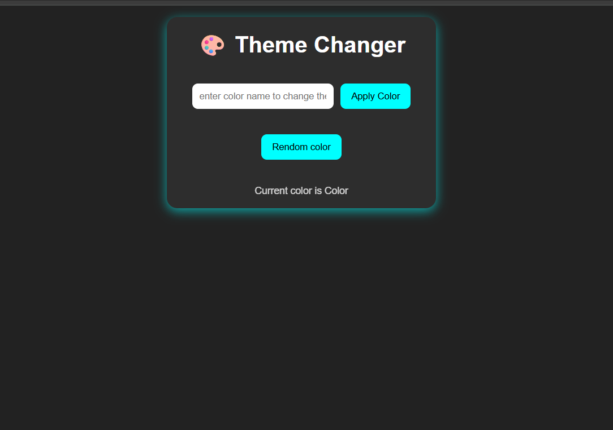

# 🎨 Theme Changer Project

A simple and interactive **Theme Changer App** built using **HTML, CSS, and JavaScript**.  
Users can change the website background color by entering a color manually or using a random color generator.

---

## 🚀 Features

- Change theme color using user input
- Apply random color from a predefined color list
- Automatically adjusts text and input color based on theme
- Smooth UI with CSS transitions

---

## 🧩 Technologies Used

- HTML5
- CSS3
- JavaScript (DOM Manipulation)

---

## 💻 How to Use

1. Enter any color name or hex code in the input field
2. Click **Apply Color** to set the background
3. Click **Random Color** to apply a random color
4. See the applied color name displayed below

---

## 🖼️ Preview

---

## 🧠 Future Improvements

- Save selected theme using **Local Storage**
- Add more advanced random color generator
- Include gradient and dark/light mode options

---

## 👨‍💻 Author

**Aman Maurya**  
[GitHub Profile](https://github.com/Aman-maurya-teq)
